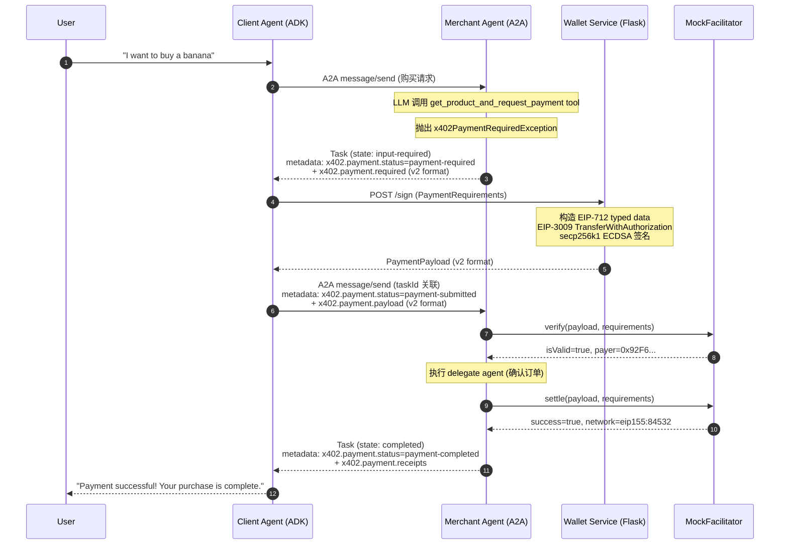

# AP2 x402 v2 A2A 端到端测试报告

- 运行时间：2026-03-19T14:31:00+08:00
- 运行环境：Python 3.14.3, pytest 9.0.2, Ubuntu 24.04 (x86_64)
- 协议版本：x402 v2, A2A x402 Extension v0.2
- 网络：Base Sepolia（`eip155:84532`）
- Facilitator：MockFacilitator（本地模拟）
- Buyer 地址：`0x92F6E9deBbEb778a245916Cf52DD7F54429Fff24`
- Merchant payTo：`0x92F6E9deBbEb778a245916Cf52DD7F54429Fff24`（测试用同地址）
- 总耗时：1.61s，27 tests 全部通过（23 unit + 4 integration）

---

## 1) 时序图与关键步骤



**关键步骤说明**：

1. **用户请求**：Client Agent 接收用户自然语言购买请求
2. **A2A 委派**：通过 A2A protocol 将请求转发给 Merchant Agent
3. **支付触发**：Merchant 的 ADK tool 抛出 `x402PaymentRequiredException`，x402ServerExecutor 捕获后构造 `payment-required` 响应
4. **EIP-3009 签名**：Wallet Service 用私钥签名 `transferWithAuthorization` (EIP-712 typed data)
5. **支付提交**：Client 将签名后的 PaymentPayload 通过 A2A `message/send` 发回（taskId 关联）
6. **验证 + 结算**：Merchant 通过 Facilitator verify → delegate 执行 → settle
7. **完成**：返回 `payment-completed` + receipts

---

## 2) 测试数据记录

### 2.1 PaymentRequired 生成（Merchant → Client）

**测试**: `test_merchant_raises_payment_exception`

Merchant Agent 的 `get_product_and_request_payment("banana")` 工具调用抛出 x402PaymentRequiredException，包含：

```json
{
  "scheme": "exact",
  "network": "eip155:84532",
  "asset": "0x036CbD53842c5426634e7929541eC2318f3dCF7e",
  "payTo": "0x92F6E9deBbEb778a245916Cf52DD7F54429Fff24",
  "maxAmountRequired": "49834596",
  "description": "Payment for: banana",
  "resource": "https://merchant.example/product/banana",
  "mimeType": "application/json",
  "maxTimeoutSeconds": 1200,
  "extra": {
    "name": "USDC",
    "version": "2",
    "product": { "sku": "banana_sku", "name": "banana", "version": "1" }
  }
}
```

> 注意：x402_a2a 库内部使用 v1 字段名 `maxAmountRequired`。在 A2A transport metadata 层，x402ServerExecutor 将其序列化为 v2 格式（含 `amount` 字段、`resource` 对象）。

**价格确定性**：`banana` → SHA-256 → mod 99900001 + 5000 = `49834596`（可重复验证）

### 2.2 Wallet 签名（Client → Wallet Service）

**测试**: `test_wallet_service_signs_requirements`, `test_sign_returns_v2_payload`

Wallet Service 接收 PaymentRequirements，返回 v2 PaymentPayload：

```json
{
  "x402Version": 2,
  "scheme": "exact",
  "network": "eip155:84532",
  "resource": {
    "url": "https://merchant.example/product/banana",
    "description": "Payment for: banana",
    "mimeType": "application/json"
  },
  "accepted": { /* 原始 PaymentRequirements */ },
  "payload": {
    "signature": "0x<65 bytes r+s+v>",
    "authorization": {
      "from": "0x92F6E9deBbEb778a245916Cf52DD7F54429Fff24",
      "to": "0x92F6E9deBbEb778a245916Cf52DD7F54429Fff24",
      "value": "49834596",
      "validAfter": "0",
      "validBefore": "<unix_timestamp + 3600>",
      "nonce": "0x<32 bytes random>"
    }
  }
}
```

**EIP-712 Domain**：
```json
{
  "name": "USDC",
  "version": "2",
  "chainId": 84532,
  "verifyingContract": "0x036CbD53842c5426634e7929541eC2318f3dCF7e"
}
```

**签名类型**：`TransferWithAuthorization(address from, address to, uint256 value, uint256 validAfter, uint256 validBefore, bytes32 nonce)`

### 2.3 MockFacilitator 验证 + 结算

**测试**: `test_mock_verify_valid`, `test_mock_settle_success`

MockFacilitator 模拟链上验证和结算：

- **verify** → `{ "isValid": true, "payer": "0x92F6..." }`
- **settle** → `{ "success": true, "network": "eip155:84532" }`

> MockFacilitator 跳过实际链上交互，直接返回成功。真实场景中 Facilitator 会调用 USDC 合约的 `transferWithAuthorization(from, to, value, validAfter, validBefore, nonce, v, r, s)`。

### 2.4 A2A Metadata 流转

**测试**: `test_create_payment_required_task`, `test_record_payment_success`, `test_metadata_roundtrip`

A2A Task metadata 状态机转换：

| 阶段 | `x402.payment.status` | A2A Task State | 数据位置 |
|------|----------------------|----------------|---------|
| 请求支付 | `payment-required` | `input-required` | `x402.payment.required` in metadata |
| 提交支付 | `payment-submitted` | `working` | `x402.payment.payload` in metadata |
| 验证通过 | `payment-verified` | `working` | task.metadata.x402_payment_verified |
| 结算完成 | `payment-completed` | `completed` | `x402.payment.receipts` in metadata |

### 2.5 E2E 完整流程

**测试**: `test_full_payment_flow`, `test_full_flow_with_wallet_service`

完整闭环验证：
1. MerchantAgent 生成 PaymentRequirements（抛异常）
2. x402Utils 创建 payment-required Task
3. Wallet 签名生成 PaymentPayload
4. MockFacilitator verify → settle
5. x402Utils 记录 payment-completed + receipts
6. 最终 Task status = `completed`，metadata 含完整 receipts 历史

---

## 3) 测试覆盖矩阵

| 测试文件 | 测试类 | 测试数 | 类型 | 覆盖范围 |
|---------|-------|-------|------|---------|
| `test_e2e.py` | TestPaymentRequirementsCreation | 3 | Unit | Merchant 工具、价格确定性、空输入 |
| `test_e2e.py` | TestWalletSigning | 2 | Unit | Wallet Service 签名、本地签名 |
| `test_e2e.py` | TestFacilitator | 3 | Unit | MockFacilitator verify/settle、失败路径 |
| `test_e2e.py` | TestX402MetadataFlow | 2 | Unit | A2A metadata 创建、receipts 记录 |
| `test_e2e.py` | TestE2EPaymentFlow | 3 | Unit | 全流程（直接调用，无 HTTP） |
| `test_e2e.py` | TestWalletServiceStandalone | 2 | Unit | Flask 服务签名、地址接口 |
| `test_wallet.py` | TestSignEndpoint | 4 | Unit | /sign v2 格式、accepts 数组、错误处理 |
| `test_wallet.py` | TestAddressEndpoint | 2 | Unit | /address GET/POST |
| `test_wallet.py` | TestSignLogic | 2 | Unit | 签名结构验证、CAIP-2 解析 |
| `test_a2a_integration.py` | TestA2AIntegration | 4 | **Integration** | 真实 A2A HTTP 服务器 + x402 中间件全链路 |
| **合计** | | **27** | | |

### Integration 测试说明

`test_a2a_integration.py` 启动真实 A2A HTTP 服务器（Starlette + uvicorn），使用 `ScriptedMerchantExecutor`（无 LLM）替代 ADKAgentExecutor，通过 JSON-RPC over HTTP 发送请求，验证完整 x402 支付中间件链路：

| 测试 | 验证内容 |
|------|---------|
| `test_initial_message_returns_payment_required` | 首次 message/send → Task input-required + x402 payment metadata |
| `test_full_payment_flow_over_http` | 完整 3 步流程：请求→签名→提交支付，全部通过真实 HTTP |
| `test_agent_card_endpoint` | .well-known/agent-card.json 端点返回有效 AgentCard |
| `test_payment_artifacts_present` | 支付完成后 Task 包含商户 artifacts（订单确认） |

---

## 4) v1 → v2 适配验证点

| 字段 | v1 (x402_a2a 内部) | v2 (A2A transport) | 验证测试 |
|------|-------------------|-------------------|---------|
| 网络标识 | `base-sepolia` | `eip155:84532` | test_caip2_chain_id_extraction |
| 金额字段 | `maxAmountRequired` | `amount` | test_sign_returns_v2_payload |
| PaymentPayload | `{scheme, network, payload}` | `{x402Version, resource, accepted, payload}` | test_sign_returns_v2_payload |
| PaymentRequired | `{x402Version, accepts}` | `{x402Version, resource, accepts, extensions}` | test_create_payment_required_task |

---

## 5) 运行结果

```
======================== 27 passed, 3 warnings in 1.61s ========================
```

全部通过 ✅（23 unit + 4 integration）

Warnings（不影响功能）：
- `google.genai.types`: `_UnionGenericAlias` deprecated in Python 3.17
- `websockets.legacy`: deprecated, 建议升级

---

## 参考

- [x402 Protocol Specification v2](https://github.com/coinbase/x402/blob/main/specs/x402-specification-v2.md)
- [A2A x402 Extension v0.2](https://github.com/google-agentic-commerce/a2a-x402/blob/main/spec/v0.2/spec.md)
- [x402 A2A Transport Spec v2](https://github.com/coinbase/x402/blob/main/specs/transports-v2/a2a.md)
- [A2A Protocol v1.0.0](https://a2a-protocol.org/latest/specification/)
- [EIP-3009: Transfer With Authorization](https://eips.ethereum.org/EIPS/eip-3009)
- [EIP-712: Typed Structured Data Hashing and Signing](https://eips.ethereum.org/EIPS/eip-712)
