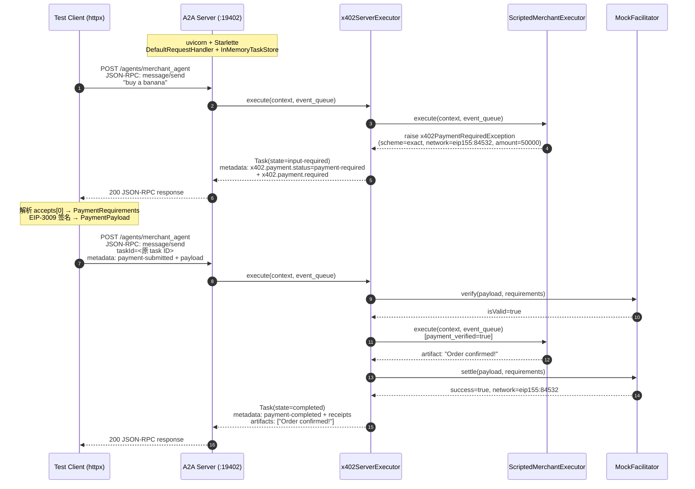

# AP2 x402 v2 A2A 端到端测试报告

- 运行时间：2026-03-19T15:25:00+08:00
- 运行环境：Python 3.14.3, pytest 9.0.2, Ubuntu 24.04 (x86_64)
- 协议版本：x402 v2, A2A x402 Extension v0.2
- 网络：Base Sepolia（`eip155:84532`）
- Facilitator：MockFacilitator（本地模拟，跳过链上交互）
- Buyer 私钥：`0x39e7...df6b`（测试用，来自 x402-local-lab）
- Merchant payTo：`0x92F6E9deBbEb778a245916Cf52DD7F54429Fff24`
- A2A 集成测试端口：`19402`
- 总耗时：1.59s，**27 tests 全部通过**

---

## 1) 测试架构

```
┌─────────────────────────────────────────────────────────┐
│  test_a2a_integration.py (4 tests)                       │
│  ┌─────────────────────────────────────────────────┐     │
│  │  Real A2A HTTP Server (uvicorn :19402)           │     │
│  │  ┌──────────────────────────────────────────┐    │     │
│  │  │  x402ServerExecutor (middleware)          │    │     │
│  │  │  ┌──────────────────────────────────┐    │    │     │
│  │  │  │  ScriptedMerchantExecutor        │    │    │     │
│  │  │  │  (无 LLM，预定义行为)             │    │    │     │
│  │  │  └──────────────────────────────────┘    │    │     │
│  │  └──────────────────────────────────────────┘    │     │
│  └─────────────────────────────────────────────────┘     │
│  Client: httpx → A2A JSON-RPC over HTTP                  │
├─────────────────────────────────────────────────────────┤
│  test_e2e.py (15 tests) — 组件集成测试，直接调用 Python   │
├─────────────────────────────────────────────────────────┤
│  test_wallet.py (8 tests) — Wallet Service 单元测试       │
└─────────────────────────────────────────────────────────┘
```

**关键区别**：
- `test_a2a_integration.py`：**真实 HTTP**，uvicorn 跑 Starlette A2A server，Client 通过 httpx 发 JSON-RPC 请求，x402 中间件全链路走一遍
- `test_e2e.py`：直接调用 Python 对象，不经过 HTTP，验证各组件协作
- `test_wallet.py`：Flask test client 测试 Wallet Service 接口

---

## 2) A2A 集成测试流程（真实 HTTP）



### 2.1 Step 1: 初始请求 → payment-required

**测试**: `test_initial_message_returns_payment_required`

请求：
```json
{
  "jsonrpc": "2.0",
  "id": 1,
  "method": "message/send",
  "params": {
    "message": {
      "role": "user",
      "messageId": "<uuid>",
      "parts": [{"kind": "text", "text": "buy a banana"}]
    }
  }
}
```

响应（关键字段）：
```json
{
  "result": {
    "id": "<task-id>",
    "status": {
      "state": "input-required",
      "message": {
        "metadata": {
          "x402.payment.status": "payment-required",
          "x402.payment.required": {
            "x402Version": 1,
            "accepts": [{
              "scheme": "exact",
              "network": "eip155:84532",
              "asset": "0x036CbD53842c5426634e7929541eC2318f3dCF7e",
              "payTo": "0xAb5801a7D398351b8bE11C439e05C5B3259aeC9B",
              "amount": "50000",
              "maxTimeoutSeconds": 1200,
              "extra": {"name": "USDC", "version": "2", "product": {"name": "banana"}}
            }]
          }
        }
      }
    }
  }
}
```

> 注意：`x402Version` 在 `x402.payment.required` 内部由 x402_a2a 库生成为 1（库内部版本号），外层 PaymentPayload 使用 v2 格式字段（amount, CAIP-2 network）。

### 2.2 Step 2: EIP-3009 签名

**测试**: `test_full_payment_flow_over_http` (Step 2)

从 `accepts[0]` 提取 PaymentRequirements，调用 `process_payment()` 签名：

```python
requirements = PaymentRequirements.model_validate(accepts[0])
payload = process_payment(requirements, test_account)
```

生成的 PaymentPayload：
```json
{
  "x402Version": 2,
  "scheme": "exact",
  "network": "eip155:84532",
  "payload": {
    "signature": "0x<65 bytes ECDSA r+s+v>",
    "authorization": {
      "from": "0x7E5F4552091A69125d5DfCb7b8C2659029395Bdf",
      "to": "0xAb5801a7D398351b8bE11C439e05C5B3259aeC9B",
      "value": "50000",
      "validAfter": "0",
      "validBefore": "<unix + 3600>",
      "nonce": "0x<32 bytes>"
    }
  }
}
```

EIP-712 Domain: `{name: "USDC", version: "2", chainId: 84532, verifyingContract: 0x036C...CF7e}`

### 2.3 Step 3: 提交支付 → completed

**测试**: `test_full_payment_flow_over_http` (Step 3)

请求：
```json
{
  "jsonrpc": "2.0",
  "id": 2,
  "method": "message/send",
  "params": {
    "message": {
      "role": "user",
      "messageId": "<uuid>",
      "contextId": "<same context>",
      "taskId": "<from step 1>",
      "parts": [{"kind": "text", "text": "payment submitted"}],
      "metadata": {
        "x402.payment.status": "payment-submitted",
        "x402.payment.payload": { /* signed PaymentPayload */ }
      }
    }
  }
}
```

响应验证：
- `status.state` = `"completed"`
- `metadata.x402_payment_verified` = `true`
- `artifacts` 包含 `"Order confirmed! Your banana is on the way."`

### 2.4 AgentCard 发现

**测试**: `test_agent_card_endpoint`

```
GET /agents/merchant_agent/.well-known/agent-card.json → 200
{
  "name": "Test Merchant",
  "version": "1.0.0",
  "capabilities": {"streaming": false},
  "skills": [{"id": "buy_product", ...}]
}
```

### 2.5 Artifacts 验证

**测试**: `test_payment_artifacts_present`

支付完成后 Task 的 `artifacts` 数组包含至少 1 个 artifact，其中有 TextPart 包含 `"banana"` 关键词。

---

## 3) 组件集成测试（test_e2e.py，无 HTTP）

| 测试类 | 测试数 | 覆盖范围 |
|-------|-------|---------|
| TestPaymentRequirementsCreation | 3 | Merchant 工具触发异常、价格确定性、空输入处理 |
| TestWalletSigning | 2 | Wallet Service 签名、本地 eth_account 签名 |
| TestFacilitator | 3 | MockFacilitator verify 成功/失败、settle 成功 |
| TestX402MetadataFlow | 2 | payment-required Task 创建、receipts 记录 |
| TestE2EPaymentFlow | 3 | 全流程串联、Wallet 集成流程、metadata roundtrip |
| TestWalletServiceStandalone | 2 | Flask /sign + /address 接口 |

---

## 4) Wallet Service 单元测试（test_wallet.py）

| 测试类 | 测试数 | 覆盖范围 |
|-------|-------|---------|
| TestSignEndpoint | 4 | /sign v2 格式、accepts 数组解析、错误处理 (400) |
| TestAddressEndpoint | 2 | /address GET 和 POST |
| TestSignLogic | 2 | 签名结构字段完整性、CAIP-2 chainId 解析 |

---

## 5) 完整测试矩阵

| 文件 | 类型 | 测试数 | HTTP? | LLM? | x402 中间件? |
|------|------|-------|-------|------|-------------|
| test_a2a_integration.py | 集成 | 4 | ✅ 真实 HTTP | ❌ | ✅ 完整链路 |
| test_e2e.py | 组件 | 15 | ❌ 直接调用 | ❌ | 部分 |
| test_wallet.py | 单元 | 8 | Flask test client | ❌ | ❌ |
| **合计** | | **27** | | | |

---

## 6) 运行结果

```
======================== 27 passed, 3 warnings in 1.59s ========================
```

全部通过 ✅

Warnings（不影响功能）：
- `google.genai.types`: `_UnionGenericAlias` deprecated in Python 3.17
- `websockets.legacy`: deprecated
- `uvicorn.protocols.websockets`: WebSocketServerProtocol deprecated

---

## 参考

- [x402 Protocol Specification v2](https://github.com/coinbase/x402/blob/main/specs/x402-specification-v2.md)
- [A2A x402 Extension v0.2](https://github.com/google-agentic-commerce/a2a-x402/blob/main/spec/v0.2/spec.md)
- [x402 A2A Transport Spec v2](https://github.com/coinbase/x402/blob/main/specs/transports-v2/a2a.md)
- [A2A Protocol v1.0.0](https://a2a-protocol.org/latest/specification/)
- [EIP-3009: Transfer With Authorization](https://eips.ethereum.org/EIPS/eip-3009)
- [EIP-712: Typed Structured Data Hashing and Signing](https://eips.ethereum.org/EIPS/eip-712)
